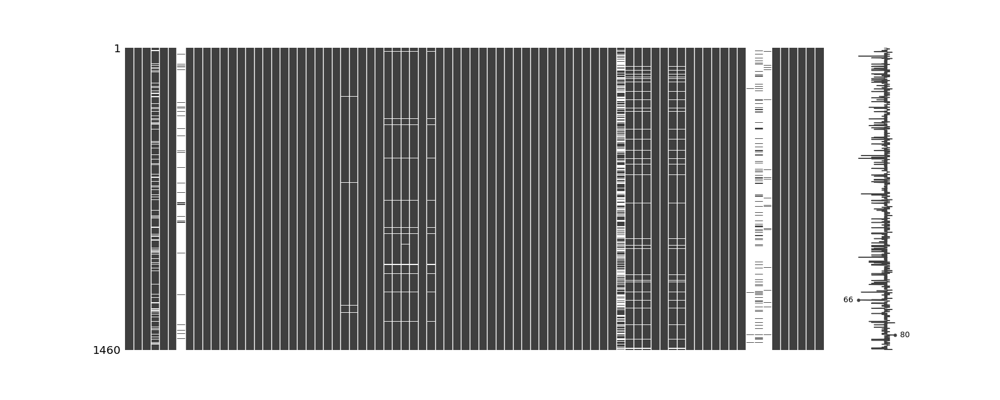

# Kaggle Exercise: Regression Model

## 1. Introduction
Regression is a method of modelling a target value based on independent predictors. This method is mostly used for forecasting and finding out cause and effect relationship between variables. Regression techniques mostly differ based on the number of independent variables and the type of relationship between the independent and dependent variables.
In this project, I want to practice how to use regression model and find out how to improve the regression model. On the first run, I would like to use all numerical data without linearity assessment. I assume the R-squared and RMSE for this model could be the baseline.

## 2. The Data: House Prices
I got the data from the Kaggle Competition. The goal from this competition is to predict sales price for each house. Ask a home buyer to describe their dream house, and they probably won't begin with the height of the basement ceiling or the proximity to an east-west railroad. But this playground competition's dataset proves that much more influences price negotiations than the number of bedrooms or a white-picket fence. With 79 explanatory variables describing (almost) every aspect of residential homes in Ames, Iowa.
Dataset has been splitted into train and test. Not like train-dataset, test-dataset didn't have complete data, it's miss the SalePrice column. To complete test-dataset, we merged it with submission.csv.

### 2.1. Data Processing
The data downloaded, as mentioned above, was cleaned up and processed before using it for model fitting. There was missing value in the data that we need to handle. The data with more than 90% missing value were utterly removed. For data with less than 50%, the missing value was imputed by their median (numeric) or mode (categoric). There was a particular case for correlation in missing value, which means the data was null because data in another column was null. The data after this initial cleanup is shown in Fig 2.
