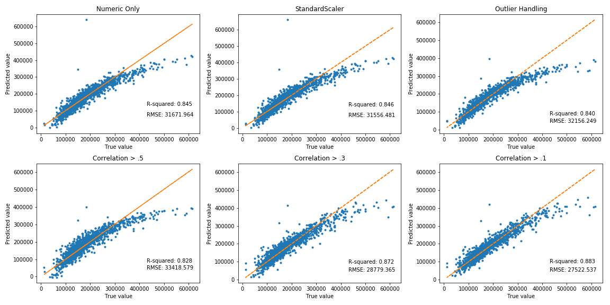

# Kaggle Exercise: Regression Model

## 1. Introduction
Regression is a method of modelling a target value based on independent predictors. This method is mostly used for forecasting and finding out cause and effect relationship between variables. Regression techniques mostly differ based on the number of independent variables and the type of relationship between the independent and dependent variables.
In this project, I want to practice how to use regression model and find out how to improve the regression model. On the first run, I would like to use all numerical data without linearity assessment. I assume the R-squared and RMSE for this model could be the baseline.
In the next move, I would like to implement some assumptions on regression model:
- Data is free of missing values and outliers
- All variables are continuous numeric, not categorical
- There is a linear relationship between predictors and predictant
- All predictors are independent of each other
- Residuals (aka prediction errors) are normally distributed
- No heteroscedacity
- Absence of multicollinearity abd auto-correlation

The linear regression model can be represented by the equation below.
> h&theta;(x) = &theta;o + &theta;1x1 + &theta;2x2 + ... + + &theta;nxn

## 2. The Data: House Prices
I got the data from the Kaggle Competition. The goal from this competition is to predict sales price for each house. Ask a home buyer to describe their dream house, and they probably won't begin with the height of the basement ceiling or the proximity to an east-west railroad. But this playground competition's dataset proves that much more influences price negotiations than the number of bedrooms or a white-picket fence. With 79 explanatory variables describing (almost) every aspect of residential homes in Ames, Iowa.
Dataset has been splitted into train and test. Not like train-dataset, test-dataset didn't have complete data, it's miss the SalePrice column. To complete test-dataset, we merged it with submission.csv.

### 2.1. Data Processing
The data downloaded, as mentioned above, was cleaned up and processed before using it for model fitting. There was missing value in the data that we need to handle. The data with more than 90% missing value were utterly removed. For data with less than 50%, the missing value was imputed by their median (numeric) or mode (categoric). There was a particular case for correlation in missing value, which means the data was null because data in another column was null. The data after this initial cleanup is shown in Fig 2.

After initial cleanup, next step was to check variation in categorical data. I used a simple matrix by compared number of each value and their average. The higher result means that column almost contains one value and not fairly distributed. So it can be completely removed when the result more than 70.

### 2.2. Feature Selection and Engineering
First step of feature engineering would be based on regression's assumptions. I would like to compare each assumption.

#### 2.2.1. Numeric Values Only
Regression model assume that all features are numeric, more specific conitnuous numeric. For baseline purpose, all numeric value were selected, without scaling process. All categorical features were removed completely. As we know that not all number is continuous, there are categorical in numeric form, we can handle it later.

> ['MSSubClass', 'LotFrontage', 'LotArea', 'OverallQual', 'OverallCond', 'YearBuilt', 'YearRemodAdd', 'MasVnrArea', 'BsmtFinSF1', 'BsmtFinSF2', 'BsmtUnfSF', 'TotalBsmtSF', '1stFlrSF', '2ndFlrSF', 'GrLivArea','BsmtFullBath', 'FullBath', 'HalfBath', 'BedroomAbvGr', 'TotRmsAbvGrd', 'Fireplaces', 'GarageYrBlt', 'GarageCars', 'GarageArea', 'WoodDeckSF', 'OpenPorchSF', 'MoSold', 'YrSold']

#### 2.2.2. Standardization with StandardScaler
The next step is standardization scaling using standardscaler. It was not only to improve score but also to make easier model interpretation and the coefficients more reliable. Standardization is when a variable is made to follow the standard normal distribution ( mean =0  and standard deviation = 1).

In a multivariate analysis when variables have widely different scales, variable(s) with higher range may overshadow the other variables in analysis.

#### 2.2.3. Outlier Handling
Outlier is a data point that differs significantly from other observations. Outlier can be expressed as value more than $Q3 + 1.5*IQR$ or less than $Q1 - 1.5*IQR$, with $IQR = Q3 - Q1$. In houseing price data, we did not remove the observation that have outlier value. We transformed the outlier value into $Q3 + 1.5*IQR$ as maximum value and $Q1 - 1.5*IQR$ as minimum value.

#### 2.2.4. One Hot Encoding and Correlation Analysis
One hot encoding is a process by which categorical variables are converted into a form that could be provided to ML algorithms to do a better job in prediction. Or refer to scikit-learn documentation defines one hot encoding is encode categorical integer features using a one-hot aka one-of-K scheme.

A correlation coefficient is a numerical measure of some type of correlation, meaning a statistical relationship between two variables. They all assume values in the range from −1 to +1, where +1 indicates the strongest positive correlation, -1 the strongest negative correlation and 0 is the weakest correlation. In this training, we would compare three threshold of coefficinet variable: correlation more than +0.5/-0.5, more than +0.3/-0.3 and more than +0.1/-0.1.

## 3. Training of Regression Model
Using the dataset with features selection in previous section, various models were trained and compared.  The description and results from these models are shown below.

### 3.1. Training Result: Numeric Values Only
The regression model performs prediction by combining all numeric value without scaling/standardisation. This model would be a baseline for next feature engineering model.
Intercept:
> 411780.8240664884

Coefficient:
> [-2.09665894e+02, -7.70098616e+01,  4.34117749e-01,  1.80732818e+04, 5.12955066e+03,  2.43820188e+02,  1.19090279e+02,  3.20337074e+01, 9.90873289e+00,  1.43098504e+00, -8.23605447e-01,  1.05161125e+01, 2.12458809e+01,  2.37681600e+01,  2.68109637e+01,  8.57148052e+03, 1.97965513e+03, -1.55984055e+03, -9.63530530e+03,  4.02416519e+03, 5.63014201e+03,  1.73565734e+02,  1.27677216e+04, -4.81269106e+00, 2.06707347e+01, -1.84572283e+00, -4.71000321e+01, -7.66864445e+02]

Training Score
> R-Squared: 0.812

> RMSE: 34475.861

### 3.2. Training Result: Standardization with StandardScaler
When all features in the same scale, it's easier to interpret. From these coefficients we could take short conclusion that OverallQual have the most positive impact when MSSubClass have the most negative impact. They means higher OverallQuall will increase SalePrice, but higher MSSubClass will decrease SalePrice. Perhaps it doesn't make sense for higher class will get cheaper sales, or it should remind me that MSSubClass even in numeric, it is still categorical and should get another handling.

Intercept:
> 180921.19589041095

Coefficient:
> [-8865.9491972 , -1695.76732218,  4331.56009023, 24986.72482286, 5706.20539294,  7361.55537745,  2457.82509304,  5787.51288932, 4581.05657485,   253.13770241,  -302.52250405,  4551.05588833, 8210.58374253, 10371.92384808, 14083.80977611,  4446.30866026, 1090.24972779,  -784.15232517, -7857.57817491,  6538.61069285, 3628.32009093,  4347.1917959 ,  9538.24180844, -1028.62419943, 2589.95753742,  -122.2483754 ,  -127.29726391, -1018.12007687]

Training Score
> R-Squared: 0.812

> RMSE: 34475.861

### 3.3. Training Result: Outlier Handling
After we handle the outliers, higher training score was obtained. It should be no high prediction and high error like two previous models. From these coefficients we got another interpretation that GrLivArea and OverallQuall gave the highest impact to increase SalePrice. But feature 1stFlrSF gave the highest impact to decrease SalePrice. It still didn't make sense, so we had to try another feature engineering and model.

Intercept:
> 177331.52636986302

Coefficient:
> [-4.07203337e+03,  8.23429604e+02,  5.05064923e+03,  1.90011681e+04, 6.25755958e+03,  1.00238015e+04, 4.18254655e+03,  1.67846929e+03, 2.68923125e+03, -3.60387276e-11, -3.07680570e+03,  1.03189793e+04, -5.11900643e+03, -2.51051326e+03,  2.97461941e+04,  2.08124211e+03, -2.06774032e+02, -1.61478651e+03, -4.78380363e+03, -2.06226297e+02, 3.81012858e+03,  2.61730267e+03,  5.60258311e+03,  1.47873951e+03, 1.95300023e+03,  1.42020535e+03,  7.33315555e+02, -7.30005756e+02]

Training Score:
> R-Squared: 0.880

> RMSE: 23314.928

## 4. Results
Observations and additional results obtained after training the models described in the previous section are shown below. Just did standardization in features could made a little improvement.

| Model | Training: R^2 | Testing: R^2 | Training: RMSE |  Testing: RMSE | Kaggle Score |
|-------|--------------:|-------------:|---------------:|---------------:|-------------:|
| Numeric only | 0.812 | 0.845 | 34475.861 | 31671.964 | 0.452 |
| StandardScaler | 0.812 | 0.846 | 34475.861 | 31556.481 | 0.254 |
| Outlier handling | 0.880 | 0.840 | 23314.928 | 32156.249 | 0.215 |
| One Hot, Corr > .5 | 0.787 | 0.828 | 36671.335 | 33418.579 | - |
| One Hot, Corr > .3 | 0.844 | 0.872 | 31352.439 | 28779.365 | - |
| One Hot, Corr > .1 | 0.853 | 0.883 | 30412.357 | 27522.537 | 0.168 |

## 5. Conclusion
Standardization could make good interpretation and good improvement. For the next submission, we should use all data.